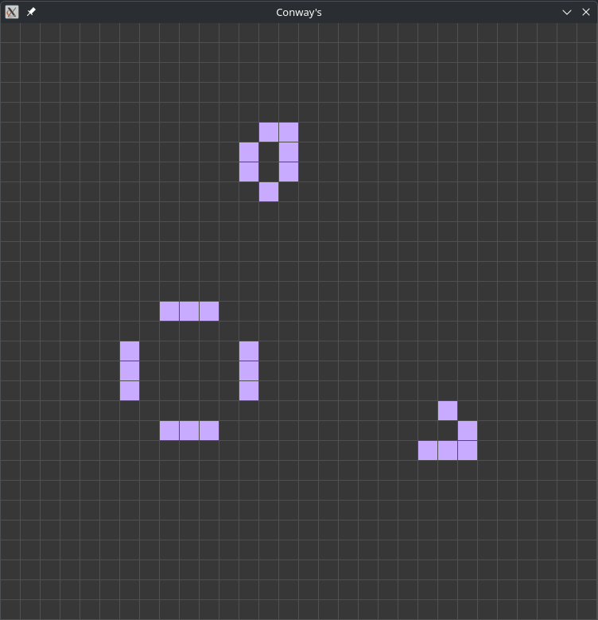

# Jogo da Vida de Conway's feito com Raylib | Game of Life de Conway's made with Raylib

An implementation of Conway's Game of Life using Raylib for graphical rendering. This project simulates the famous cellular automaton, where cells in a grid evolve with each generation based on simple rules.

- Fast and efficient rendering with Raylib
- Possibility to pause (Space)
- Minimalist and interactive interface

## ScreenShots:

### Main Screen:

